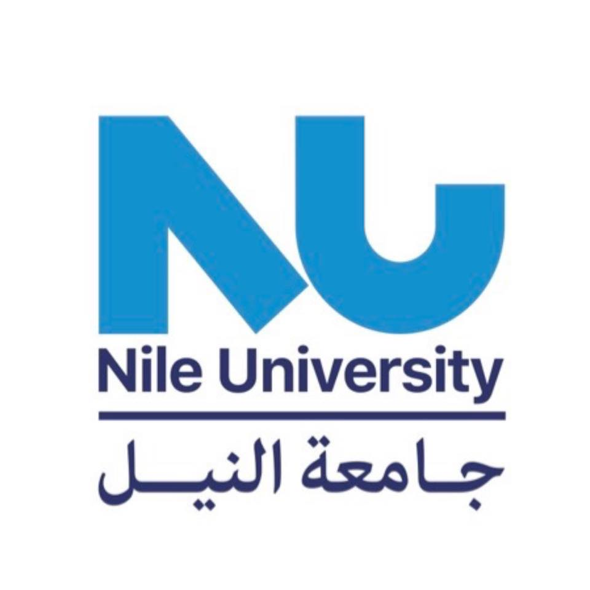

# **RPMNU WebPage**
Welcome to the **RPMNU WebPage** project! This is a web application designed to provide a modern and user-friendly interface for managing and displaying content for RPMNU.

---

## **Table of Contents**
1. [Features](#features)
2. [Technologies Used](#technologies-used)
4. [Acknowledgments](#Acknowledgments)

---

## **Features**
- **Main Menu**: Easy navigation through the application.
- **Responsive Design**: Works seamlessly on all devices.
- **Dynamic Content**: Content is dynamically loaded based on user input.
- **Authentication**: Secure user authentication system.
- **Custom UI Components**: Built using modern UI libraries like Tailwind CSS and Shadcn UI.

---

## **Technologies Used**
- **Frontend**: Next.js, React, Tailwind CSS
- **Backend**: Node.js
- **Other Tools**: Git, npm

---

## **Acknowledgments**
- **Special thanks to our team members and the open-source community for their support and contributions.**
  
